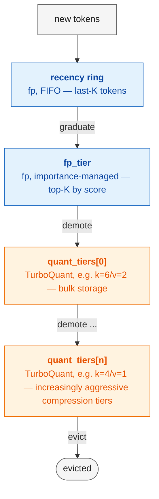

# KVCascade

**KV-C**ache with **A**daptive **S**core-based **C**ompression **A**nd **D**ecay-driven **E**viction.

A memory-bounded KV cache for long-context decoder inference. Tokens flow through a
hierarchy of precision tiers — the recent and load-bearing
ones at full precision, and the unimportant tail evicted entirely. Importance
is driven per (layer, kv-head) by a decaying score on accumulated attention received,
so each head independently decides which tokens to keep.

Compression on what's kept is done with [TurboQuant](https://arxiv.org/abs/2504.16127)
(norm + Haar-rotated Lloyd-Max + 1-bit JL residual sketch). Eviction is in the
spirit of [H2O](https://arxiv.org/abs/2306.14048) / [SnapKV](https://arxiv.org/abs/2404.14469).
The combination — quantize what you keep, evict what you don't — gives a Pareto
improvement over either approach alone on long-context language modeling.


Supports an arbitrary hierarchy of quantized tiers with increasingly aggressive quantization, but findings show that single quantization tier performs the best, since excessive quantization introduces adversarial noise in the inner product estimation - better to evict than to keep.

## Headline result

Sequential-decode evaluation on **wikitext-103**, top-1 agreement against fp32 reference,
**3 base models × 2 context lengths × 50 samples each** (300 sequences total). All numbers
are mean ± standard deviation across the 50 wikitext chunks.

### Iso-byte head-to-head — KVCascade vs uniform TurboQuant (k=6/v=2)

At the same total cache byte budget, KVCascade beats uniform on every (model, context)
pair tested:

| Model | ctx | uniform | H2O (ring=0) | H2O (ring=8) | **KVCascade** | **Δ vs uniform** |
|---|---|---|---|---|---|---|
| Qwen3-0.6B | 4096 | 70.3 ± 8.0 | 20.5 ± 5.6 | 74.0 ± 6.0 | **86.7 ± 5.5** | **+16.4 pp** |
| Qwen3-0.6B | 8192 | 66.5 ± 8.0 | 18.2 ± 4.6 | 72.0 ± 5.5 | **80.6 ± 5.9** | **+14.1 pp** |
| Llama-3.2-1B | 4096 | 87.2 ± 5.0 | 24.2 ± 6.8 | 76.3 ± 6.0 | **96.8 ± 1.9** | **+9.6 pp** |
| Llama-3.2-1B | 8192 | 87.4 ± 2.9 | 22.0 ± 5.6 | 77.1 ± 5.2 | **96.5 ± 1.7** | **+9.1 pp** |
| OLMo-2-1B | 4096 | 90.7 ± 3.8 | 25.1 ± 7.2 | 79.2 ± 4.9 | **96.8 ± 2.2** | **+6.1 pp** |
| OLMo-2-1B | 8192 | 80.2 ± 5.6 | 63.7 ± 9.7 | 65.2 ± 9.2 | **92.6 ± 2.8** | **+12.4 pp** |

The win ranges from **+6.1 pp** (Llama / OLMo at short context, where uniform is already
strong) to **+16.4 pp** (Qwen3 at short context, where uniform is weakest). KVCascade
also has the lowest variance of any compressed config — sd shrinks to ~2 pp on Llama and
OLMo at 4k vs ~5 pp for uniform.

### Sub-iso-byte: KVCascade matches uniform with much less memory

The smallest byte ratio at which KVCascade still matches uniform's top-1 (within 1 pp):

| Model | KVCascade matches uniform at | additional compression |
|---|---|---|
| Qwen3-0.6B (both contexts) | **0.0625× uniform's bytes** | **16× more compression** |
| Llama-3.2-1B (both contexts) | **0.125× uniform's bytes** | **8× more compression** |
| OLMo-2-1B (both contexts) | **0.25× uniform's bytes** | **4× more compression** |

For Qwen3-0.6B at ctx=8192, KVCascade at **0.25× uniform's bytes (15.3× compression vs
fp16)** actually slightly *outperforms* KVCascade at iso-byte (83.2 ± 5.3 vs 80.6 ± 5.9).
Removing the long tail of low-importance tokens reduces softmax noise enough to net out
ahead of keeping them at quantized precision.

### Throughput tradeoff

KVCascade pays a consistent **~1.7–1.8× decode-latency cost** vs uniform across all 6
configs (decode tok/s on a single H100, bf16):

| Model | ctx | uniform decode tok/s | KVCascade decode tok/s | slowdown |
|---|---|---|---|---|
| Qwen3-0.6B | 4096 | 16.0 | 9.2 | 1.74× |
| Qwen3-0.6B | 8192 | 15.1 | 8.5 | 1.78× |
| Llama-3.2-1B | 4096 | 27.1 | 15.8 | 1.72× |
| Llama-3.2-1B | 8192 | 35.2 | 19.4 | 1.81× |
| OLMo-2-1B | 4096 | 30.2 | 17.0 | 1.78× |
| OLMo-2-1B | 8192 | 28.2 | 16.6 | 1.70× |

The tradeoff is well-characterized: **trade ~1.7× decode latency for +6 to +16 pp top-1
accuracy at the same byte budget.** The slowdown comes from per-step cascade competition,
ring writes, and importance-score updates; H2O (no quantization) is faster than uniform,
KVCascade is slower than both.

### Ablation — each component contributes

Decomposing the iso-byte gap from H2O to KVCascade by adding one component at a time:

| Step | Qwen3 4k | Llama 4k | OLMo 4k | OLMo 8k |
|---|---|---|---|---|
| H2O (eviction only) | 20.5% | 24.2% | 25.1% | 63.7% |
| **+ recency ring (size 8)** | **+53.6 pp** | **+52.1 pp** | **+54.2 pp** | +1.5 pp |
| **+ TurboQuant tier (KVCascade)** | **+12.7 pp** | **+20.5 pp** | **+17.6 pp** | **+27.4 pp** |
| Total: KVCascade top-1 | 86.7% | 96.8% | 96.8% | 92.6% |

The recency ring is dramatic on most configs (+52–55 pp), reflecting that pure-eviction
H2O without a recency window misclassifies the just-arrived decode token as low-priority.
On OLMo at 8192, plain H2O is already at 63.7% (much stronger than the 18–25% on the
other configs) so the ring contributes less *relatively*; the quantization tier picks up
the slack with a +27.4 pp lift on top.

### Why KVCascade wins where it does

- **Diffuse-attention models (Qwen3, OLMo-2) — entropy ≈ 77–82% of uniform-max on
  wikitext.** Many tokens contribute non-trivially to each softmax, so uniform's
  per-token quantization noise compounds. KVCascade keeps the heavy hitters at fp and
  evicts the long tail, breaking the noise compounding.
- **Peaky-attention models (Llama-3.2-1B) — entropy ≈ 37% of uniform-max.** Eviction
  has a structural advantage here, which is why uniform is already strong (87% top-1).
  KVCascade still wins by ~9 pp because the recency ring keeps the just-arrived decode
  token at fp, and the importance-driven fp tier catches the heavy hitters cleanly.

## Layout

```
src/
  lloyd_max.py    LloydMaxCodebook  — Lloyd-Max codebook for unit Gaussians
  polar_quant.py  PolarQuant        — norm + Haar-rotated Lloyd-Max, batched on last dim
  jl_quant.py     JLQuantizer       — 1-bit JL sketch for inner-product estimation
  turbo_quant.py  TurboQuant        — Polar coarse code + JL residual sketch
  turbo_attn.py   bit packing, TurboQuantKVCache, HF dispatcher integration
  kvcascade.py    KVCascadeCache    — recency ring + fp tier + N quant tiers + eviction

eval.py            sequential-decode eval on wikitext-103 (CUDA, bf16)

notebooks/         demos and quantizer walkthroughs (single-shot regime)
```

## Quick start

```python
import sys; sys.path.insert(0, "src")
from transformers import AutoModelForCausalLM, AutoTokenizer
from kvcascade import KVCascadeCache, install_kvcascade

model = AutoModelForCausalLM.from_pretrained(
    "Qwen/Qwen3-0.6B", torch_dtype="bfloat16", attn_implementation="eager"
).cuda().eval()
tok = AutoTokenizer.from_pretrained("Qwen/Qwen3-0.6B")

cfg = model.config
cache = KVCascadeCache(
    num_layers=cfg.num_hidden_layers,
    batch_size=1,
    num_heads=cfg.num_attention_heads,
    num_kv_heads=cfg.num_key_value_heads,
    head_dim=cfg.head_dim,
    ring_size=8,
    fp_capacity=256,
    quant_tiers=[(6, 2, 2048)],   # one quant tier at k=6/v=2 with 2048 slots
    score_policy="ema",
    device="cuda", dtype="bfloat16",
)
n = install_kvcascade(model, cache)   # registers attn dispatcher on every layer

# Use the model normally; the cache fills/cascades/evicts under the hood.
ids = tok("…long context here…", return_tensors="pt").input_ids.cuda()
out = model(ids, use_cache=False)     # use_cache=False — we manage caching ourselves
```

For RoPE / QK-norm / GQA models (Llama, Qwen, Mistral, Gemma, modern GPT-2 etc.), just
swap the model name. The attention dispatcher hook intercepts only the SDPA step —
RoPE, QK-norm, GQA, sliding window, and anything else the model does to Q/K/V before
SDPA flows through unchanged.

## Configuration

`KVCascadeCache.__init__` is the main API. The interesting knobs:

- **`ring_size`**: FIFO recency buffer at fp. Recently-arrived tokens live here for
  `ring_size` steps before being scored and graduating to the persistent tiers.
- **`fp_capacity`**: importance-managed fp tier above the quant tiers. Top-`fp_capacity`
  tokens by accumulated attention live here at full precision. Set to 0 to disable
  ("only ring + quant + evict").
- **`quant_tiers`**: a list of `(k_bits, v_bits, capacity)` tuples — one per TurboQuant
  tier, in cascade order (most precise first). Pass `[]` for "ring + fp + evict"
  (a pure H2O-on-fp setup). Common configs:
  - `[(6, 2, N)]` — single bulk tier at uniform's "working" precision; aggressive
    eviction past it. *This is what we recommend for QK-norm models like Qwen3.*
  - `[(4, 2, N)]` — same but at lower precision; OK for vanilla / RoPE-only models.
  - `[(6, 2, A), (4, 1, B)]` — two quant tiers; tail tokens get demoted into the
    aggressive second tier rather than evicted. Higher capacity, but the aggressive
    tier's IP-noise can hurt on sharp-softmax models.
- **`score_policy`**: how attention received drives the importance score.
  - `"ema"` (default) — exponential moving average of per-query mean attention.
    Decaying, workload-independent, adaptive.
  - `"cumulative"` — H2O-style monotonic sum. Strictly preserves what's been hot
    historically. We've found EMA slightly outperforms cumulative on sequential decode.

For sizing, a useful starting point at iso-byte versus uniform `k=6/v=2`:
`ring_size=8`, `fp_capacity=ctx_len // 16`, `quant_tiers=[(6, 2, ~ctx_len * 13/16)]`.
Halve the quant capacity for ~½ uniform bytes, etc.

## Running the eval

```bash
pip install -r requirements.txt
python eval.py --model Qwen/Qwen3-0.6B --samples 50 --ctx-len 4096 --decode-len 64
```

Pulls non-overlapping wikitext-103 chunks of `ctx_len` tokens, runs prefill +
sequential decode for uniform TurboQuant, H2O, H2O+ring, and KVCascade, plus a
KVCascade compression sweep. Writes `report.md` with tables and figures, plus
`raw.json` with per-sample numbers. Per-method prefill/decode tok/s are timed
inline (CUDA-synchronized).

For multi-model + multi-context grids, see `run_evals.sh` (sequential, local) or
`modal_eval.py` (parallelized across containers on Modal — one (model, ctx) pair
per GPU, runs 6 configs concurrently).

The eval uses **teacher forcing** — at each decode step we feed the ground-truth
token from the original sequence, and compare the model's argmax to the fp reference's
argmax at that position. So we're measuring quantization fidelity *given correct
history*, not generation quality with cumulative prediction errors. This is a more
isolated metric for comparing cache strategies but does *not* characterize free-running
generation drift.

## When does KV-CASCADE win?

The empirical picture across the 3-model × 2-context sweep above:

- **Long-context sequential decode (autoregressive generation):** KVCascade wins on
  every configuration tested — 6 of 6 model × context pairs. The win does not narrow
  going from ctx=4096 to ctx=8192; on OLMo it widens from +6.1 to +12.4 pp.

- **Diffuse-attention models (Qwen3, OLMo-2 — entropy ≈ 77–82% of uniform-max on
  wikitext):** KVCascade has its largest wins here (+6.1 to +16.4 pp). Quantization
  noise compounds across many contributing tokens; eviction breaks the compounding
  by removing the long tail.

- **Peaky-attention models (Llama-3.2-1B — entropy ≈ 37% of uniform-max):** KVCascade
  still wins (+9.1 to +9.6 pp), even though peaky attention is the regime where
  pure-eviction (H2O) was originally designed to shine. The recency ring + fp tier
  capture the peaky structure cleanly; the quant tier handles the rest.

- **Single-shot prefill scoring:** Uniform TurboQuant is competitive. The cache is
  only used for one big attention call, so reuse benefits don't accumulate; the fp
  tier just spends bytes a uniform-quant baseline doesn't.

- **Sparse-attention QA / NIAH-style workloads:** Not measured in the headline sweep.
  Earlier exploratory runs showed that aggressive eviction can drop tokens the model
  needs to retrieve the answer; tuning `fp_capacity` matters more here.

- **QK-normed models (Qwen3, OLMo-2):** Need `k_bits ≥ 5` in the bulk quant tier,
  otherwise the IP-estimator noise overwhelms QK-norm's sharper softmax (same
  threshold uniform TurboQuant has on these architectures). The headline numbers
  above use `k_bits=6, v_bits=2`. Below `k_bits=5`, no amount of cache hierarchy
  fixes it.

- **Throughput cost is real but bounded:** ~1.7–1.8× decode-latency hit vs uniform,
  consistent across models and context lengths. Most of the cost is per-step cascade
  competition + score updates; the G=1 decode fast path already skips the full topk
  pool and `dequantize_all`. Further kernel-level optimization is open work.

## Implementation notes

**Vectorized cascade.** When the recency ring evicts (one or more graduates), the
graduates compete against tier residents in parallel across `(B, H_kv)`. Each tier
runs a single `topk` over the `[residents | candidates]` pool, then scatters winners
into open slots. Demoted residents continue down the chain. No Python-level loops
over slots or heads.

**Hybrid attention path.** Each attention call computes scores against *(quantized
prefix) ⊕ (fresh K/V)* and stores the fresh K/V into the ring afterwards. So a
just-arrived token contributes *exactly* to its own attention call (no quantization
round-trip), and the per-token fidelity drop only kicks in for subsequent steps that
re-read it from the cache.

**GQA-aware storage.** All buffers live at kv-head granularity (matching what HF
would actually allocate). Expansion to query-head count happens at attention compute
time, not at storage. Compression vs an fp16 KV cache stays apples-to-apples on
grouped-query models.

**Bit-packed storage.** All Lloyd-Max indices and JL sign sketches are bit-packed
into uint8 buffers (no padding to byte boundaries). Pack/unpack are pure tensor ops
with fast paths for power-of-2 widths.

**HF dispatcher integration.** `kvcascade.py` registers a function under
`transformers.modeling_utils.ALL_ATTENTION_FUNCTIONS["kvcascade"]`. `install_kvcascade(model, cache)`
flips `model.config._attn_implementation` to `"kvcascade"` and stamps the cache onto
every attention module. Works on any model that dispatches through ALL_ATTENTION_FUNCTIONS
(Llama, Qwen, Mistral, Gemma, modern GPT-2, etc.). No model-class-specific wrappers.

## Caveats

- v1 supports `batch_size=1` only.
- All headline numbers are mean ± sd over **N=50** non-overlapping wikitext-103
  chunks. Longer eval runs would tighten the confidence intervals further but would
  not change the qualitative ranking — KVCascade beats uniform on every config by a
  margin much larger than the sd.
- **Free-running generation hasn't been evaluated.** All numbers are teacher-forced
  top-1 against an fp32 reference: at each decode step we feed the ground-truth token
  and compare argmax. This isolates quantization fidelity from cumulative prediction
  drift, which is the right metric for comparing cache strategies — but real
  free-running generation may behave differently and is not characterized here.
- **The win is sequential-decode-specific.** Single-shot prefill scoring (no decode
  loop, cache used only once) doesn't show the same gap; uniform TurboQuant is
  competitive there.
- **Throughput tradeoff:** ~1.7–1.8× decode latency vs uniform. For
  latency-critical workloads with weak accuracy demands, uniform is the better pick.
- **Eval is wikitext-only.** Results may differ on conversational, code, or sparse-
  retrieval workloads (NIAH/QA) — the importance scoring assumptions hold across
  domains in principle, but eviction friendliness varies sharply with task structure.

## Acknowledgements

KVCascade builds directly on ideas from prior work on KV-cache compression:

- **[TurboQuant](https://arxiv.org/abs/2504.19874)** (Mahankali et al., 2025) —
  norm + Haar-rotated Lloyd-Max coarse code + 1-bit JL residual sketch is the
  per-token compression primitive used in KVCascade's quant tiers. The cascade
  hierarchy is what's new on top.
- **[H2O](https://arxiv.org/abs/2306.14048)** (Zhang et al., 2023) — accumulated-
  attention scoring for "heavy hitter" identification. The fp tier's importance-driven
  retention and the cascade's eviction-on-loss policy are H2O in spirit, generalized
  across precision tiers.
- **[SnapKV](https://arxiv.org/abs/2404.14469)** (Li et al., 2024) — windowed
  attention pooling for importance estimation, and the observation that recent tokens
  matter disproportionately. Influenced the recency-ring design.
- **[StreamingLLM](https://arxiv.org/abs/2309.17453)** (Xiao et al., 2024) — the
  "attention sinks" insight (a few persistent high-attention tokens carry
  disproportionate weight) motivates keeping the importance-managed fp tier always-on.

This codebase was developed as the course project for **CMU 15-642: Machine Learning
Systems** (Spring 2026).
