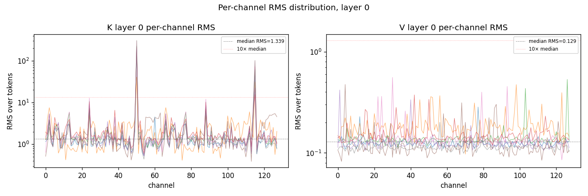
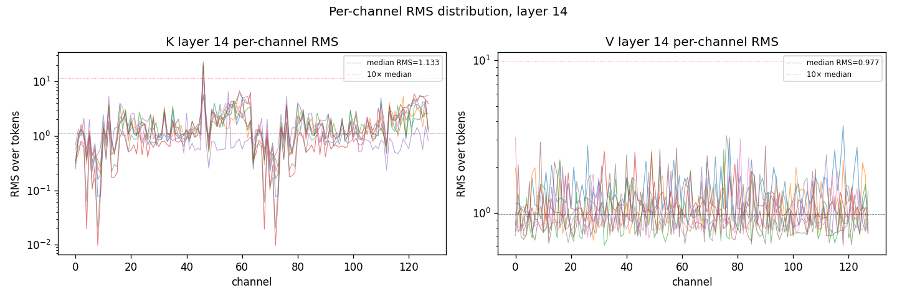
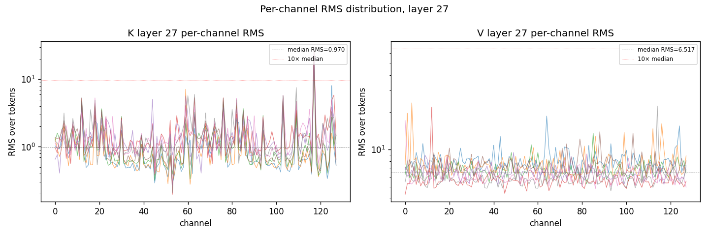

# Real K/V distortion on Qwen/Qwen3-0.6B (Task 2)

Single forward pass, ctx_len=2048 wikitext-103, layers captured: [0, 14, 27], fp32 metrics on bf16 K/V.

## Outlier characterization

Fraction of (head, channel) pairs whose RMS-over-tokens exceeds 10× the layer's median RMS.

| layer | D | H_kv | tokens | K median RMS | K max RMS | K %chan >10× med | V median RMS | V max RMS | V %chan >10× med |
|---|---|---|---|---|---|---|---|---|---|
| 0 | 128 | 8 | 2048 | 1.339 | 307.523 | 1.6% | 0.129 | 0.558 | 0.0% |
| 14 | 128 | 8 | 2048 | 1.132 | 23.073 | 0.6% | 0.977 | 3.709 | 0.0% |
| 27 | 128 | 8 | 2048 | 0.970 | 28.429 | 0.8% | 6.516 | 23.826 | 0.0% |

## K distortion across methods

| layer | bits | method | MSE mean | MSE median | MSE p99 | cos mean | IP rel median | IP rel p99 |
|---|---|---|---|---|---|---|---|---|
| 0 | 3 | ours.PolarQuant (MSE) | 1.445e+01 | 1.026e+01 | 5.444e+01 | 0.9828 | 1.767 | 123.866 |
| 0 | 3 | ours.TurboQuant (Prod) | 4.932e+01 | 3.482e+01 | 1.859e+02 | 0.9395 | 3.371 | 238.692 |
| 0 | 3 | back2match.TurboQuantMSE | 1.316e+01 | 9.266e+00 | 4.759e+01 | 0.9834 | 1.888 | 132.068 |
| 0 | 3 | back2match.TurboQuantIP | 3.325e+01 | 2.362e+01 | 1.205e+02 | 0.9587 | 2.690 | 182.805 |
| 0 | 3 | hackimov.TurboQuantProd | 6.851e+01 | 4.797e+01 | 2.630e+02 | 0.9292 | 5.541 | 391.514 |
| 0 | 4 | ours.PolarQuant (MSE) | 3.762e+00 | 2.750e+00 | 1.388e+01 | 0.9955 | 0.947 | 66.791 |
| 0 | 4 | ours.TurboQuant (Prod) | 1.445e+01 | 1.026e+01 | 5.444e+01 | 0.9828 | 1.767 | 123.866 |
| 0 | 4 | vivek.TurboQuantizer (MSE) | 3.526e+00 | 2.503e+00 | 1.312e+01 | 0.9958 | 0.915 | 63.960 |
| 0 | 4 | back2match.TurboQuantMSE | 4.625e+00 | 3.259e+00 | 1.623e+01 | 0.9941 | 1.215 | 84.581 |
| 0 | 4 | back2match.TurboQuantIP | 1.111e+01 | 7.807e+00 | 4.018e+01 | 0.9860 | 1.737 | 121.584 |
| 0 | 4 | hackimov.TurboQuantProd | 2.189e+01 | 1.531e+01 | 8.687e+01 | 0.9760 | 2.738 | 195.862 |
| 0 | 5 | ours.PolarQuant (MSE) | 1.026e+00 | 7.068e-01 | 4.039e+00 | 0.9988 | 0.490 | 34.833 |
| 0 | 5 | ours.TurboQuant (Prod) | 3.762e+00 | 2.750e+00 | 1.388e+01 | 0.9955 | 0.947 | 66.791 |
| 0 | 5 | back2match.TurboQuantIP | 3.915e+00 | 2.761e+00 | 1.376e+01 | 0.9950 | 1.101 | 76.695 |
| 0 | 5 | hackimov.TurboQuantProd | 6.788e+00 | 4.821e+00 | 2.617e+01 | 0.9920 | 1.311 | 92.316 |
| 14 | 3 | ours.PolarQuant (MSE) | 2.091e-01 | 1.827e-01 | 5.288e-01 | 0.9822 | 0.295 | 20.241 |
| 14 | 3 | ours.TurboQuant (Prod) | 7.039e-01 | 6.274e-01 | 1.567e+00 | 0.9383 | 0.532 | 35.804 |
| 14 | 3 | back2match.TurboQuantMSE | 2.732e-01 | 2.532e-01 | 5.775e-01 | 0.9776 | 0.333 | 21.895 |
| 14 | 3 | back2match.TurboQuantIP | 6.146e-01 | 5.648e-01 | 1.239e+00 | 0.9485 | 0.485 | 31.399 |
| 14 | 3 | hackimov.TurboQuantProd | 1.073e+00 | 9.694e-01 | 2.345e+00 | 0.9195 | 0.698 | 48.310 |
| 14 | 4 | ours.PolarQuant (MSE) | 5.856e-02 | 4.914e-02 | 1.892e-01 | 0.9951 | 0.156 | 10.707 |
| 14 | 4 | ours.TurboQuant (Prod) | 2.091e-01 | 1.827e-01 | 5.288e-01 | 0.9822 | 0.295 | 20.241 |
| 14 | 4 | vivek.TurboQuantizer (MSE) | 5.250e-02 | 4.747e-02 | 1.120e-01 | 0.9955 | 0.153 | 10.523 |
| 14 | 4 | back2match.TurboQuantMSE | 1.049e-01 | 9.503e-02 | 2.615e-01 | 0.9915 | 0.208 | 13.999 |
| 14 | 4 | back2match.TurboQuantIP | 2.304e-01 | 2.135e-01 | 4.866e-01 | 0.9813 | 0.305 | 20.104 |
| 14 | 4 | hackimov.TurboQuantProd | 3.147e-01 | 2.829e-01 | 7.222e-01 | 0.9743 | 0.375 | 25.699 |
| 14 | 5 | ours.PolarQuant (MSE) | 1.565e-02 | 1.287e-02 | 6.291e-02 | 0.9987 | 0.080 | 5.540 |
| 14 | 5 | ours.TurboQuant (Prod) | 5.856e-02 | 4.914e-02 | 1.892e-01 | 0.9951 | 0.156 | 10.707 |
| 14 | 5 | back2match.TurboQuantIP | 8.844e-02 | 8.008e-02 | 2.211e-01 | 0.9928 | 0.190 | 12.798 |
| 14 | 5 | hackimov.TurboQuantProd | 9.922e-02 | 8.923e-02 | 2.180e-01 | 0.9916 | 0.211 | 14.500 |
| 27 | 3 | ours.PolarQuant (MSE) | 2.406e-01 | 2.348e-01 | 5.131e-01 | 0.9839 | 0.327 | 20.276 |
| 27 | 3 | ours.TurboQuant (Prod) | 8.329e-01 | 8.194e-01 | 1.748e+00 | 0.9426 | 0.595 | 36.456 |
| 27 | 3 | back2match.TurboQuantMSE | 3.367e-01 | 3.192e-01 | 7.516e-01 | 0.9783 | 0.351 | 21.938 |
| 27 | 3 | back2match.TurboQuantIP | 7.651e-01 | 7.432e-01 | 1.600e+00 | 0.9497 | 0.518 | 31.554 |
| 27 | 3 | hackimov.TurboQuantProd | 1.335e+00 | 1.283e+00 | 2.902e+00 | 0.9200 | 0.818 | 50.785 |
| 27 | 4 | ours.PolarQuant (MSE) | 6.625e-02 | 6.427e-02 | 1.438e-01 | 0.9956 | 0.173 | 10.784 |
| 27 | 4 | ours.TurboQuant (Prod) | 2.406e-01 | 2.348e-01 | 5.131e-01 | 0.9839 | 0.327 | 20.276 |
| 27 | 4 | vivek.TurboQuantizer (MSE) | 6.594e-02 | 6.366e-02 | 1.469e-01 | 0.9956 | 0.171 | 10.655 |
| 27 | 4 | back2match.TurboQuantMSE | 1.273e-01 | 1.145e-01 | 3.325e-01 | 0.9919 | 0.220 | 13.878 |
| 27 | 4 | back2match.TurboQuantIP | 2.840e-01 | 2.692e-01 | 6.340e-01 | 0.9819 | 0.324 | 20.078 |
| 27 | 4 | hackimov.TurboQuantProd | 3.858e-01 | 3.680e-01 | 8.699e-01 | 0.9750 | 0.431 | 26.837 |
| 27 | 5 | ours.PolarQuant (MSE) | 1.756e-02 | 1.715e-02 | 3.832e-02 | 0.9988 | 0.089 | 5.503 |
| 27 | 5 | ours.TurboQuant (Prod) | 6.625e-02 | 6.427e-02 | 1.438e-01 | 0.9956 | 0.173 | 10.784 |
| 27 | 5 | back2match.TurboQuantIP | 1.074e-01 | 9.673e-02 | 2.796e-01 | 0.9932 | 0.203 | 12.748 |
| 27 | 5 | hackimov.TurboQuantProd | 1.247e-01 | 1.202e-01 | 2.692e-01 | 0.9918 | 0.246 | 15.366 |

## V distortion across methods

| layer | bits | method | MSE mean | MSE median | MSE p99 | cos mean |
|---|---|---|---|---|---|---|
| 0 | 3 | ours.PolarQuant (MSE) | 7.319e-04 | 6.875e-04 | 2.051e-03 | 0.9831 |
| 0 | 3 | back2match.TurboQuantMSE | 1.094e-03 | 9.967e-04 | 2.957e-03 | 0.9759 |
| 0 | 4 | ours.PolarQuant (MSE) | 2.012e-04 | 1.879e-04 | 5.824e-04 | 0.9954 |
| 0 | 4 | back2match.TurboQuantMSE | 4.457e-04 | 3.884e-04 | 1.653e-03 | 0.9902 |
| 0 | 5 | ours.PolarQuant (MSE) | 5.262e-05 | 4.909e-05 | 1.474e-04 | 0.9988 |
| 14 | 3 | ours.PolarQuant (MSE) | 4.593e-02 | 3.180e-02 | 1.729e-01 | 0.9830 |
| 14 | 3 | back2match.TurboQuantMSE | 6.795e-02 | 4.530e-02 | 2.039e-01 | 0.9769 |
| 14 | 4 | ours.PolarQuant (MSE) | 1.255e-02 | 8.636e-03 | 4.843e-02 | 0.9954 |
| 14 | 4 | back2match.TurboQuantMSE | 2.785e-02 | 1.697e-02 | 9.400e-02 | 0.9910 |
| 14 | 5 | ours.PolarQuant (MSE) | 3.312e-03 | 2.277e-03 | 1.633e-02 | 0.9988 |
| 27 | 3 | ours.PolarQuant (MSE) | 1.677e+00 | 1.486e+00 | 5.133e+00 | 0.9832 |
| 27 | 3 | back2match.TurboQuantMSE | 2.474e+00 | 2.179e+00 | 7.649e+00 | 0.9767 |
| 27 | 4 | ours.PolarQuant (MSE) | 4.616e-01 | 4.048e-01 | 1.451e+00 | 0.9954 |
| 27 | 4 | back2match.TurboQuantMSE | 9.845e-01 | 8.179e-01 | 3.350e+00 | 0.9908 |
| 27 | 5 | ours.PolarQuant (MSE) | 1.216e-01 | 1.067e-01 | 4.015e-01 | 0.9988 |

## Per-channel RMS figures

## Findings

**Capture point**: K, V tensors recorded inside `ALL_ATTENTION_FUNCTIONS` — i.e., exactly what the attention function (and our cache) consumes: post-`k_proj`, post-`k_norm` (Qwen3 QK-norm), post-RoPE.

### Outlier pattern (post-QK-norm)

Community reports `~5 to 20%` of K channels with `10× to 100×` larger RMS than the median, concentrated at layer 0. On Qwen3-0.6B with QK-norm, we see the *outlier magnitude* (layer 0 max RMS = 307× layer median) but a much *smaller fraction* (0.6–1.6% of channels per layer). Plausible explanation: QK-norm centralizes most channels so only the truly extreme ones break out; in non-QK-normed models (Llama family) the fraction would likely be higher.

### MSE vs Prod on real K — community pattern reproduces

At each (layer, bits) we measured, ours.PolarQuant (MSE) has lower IP relative error and lower reconstruction MSE than ours.TurboQuant (Prod) at the same total bit budget. Aggregating IP rel median across layers 14 and 27 (less affected by layer-0 outliers) at b=4:

| layer | ours.MSE IP rel | ours.Prod IP rel | Prod/MSE |
|---|---|---|---|
| 14 | 0.156 | 0.295 | 1.89× |
| 27 | 0.173 | 0.327 | 1.89× |

Prod IP error is ~1.9× higher than MSE IP error on real K at 4 bits across non-outlier layers. **This reproduces the scos-lab and tonbistudio finding.** Whether this translates to top-1 accuracy gaps under softmax is what Task 4 measures.

### Cross-reference agreement

`vivek.TurboQuantizer (MSE)` at b=4 matches `ours.PolarQuant (MSE)` within 1–10% across all three layers (layer 0: vivek 9% lower; layer 14: vivek 3% lower; layer 27: vivek 1% lower). On real K data the agreement is tighter than on synthetic Gaussian data (where the tail-handling differed). This is consistent with the codebooks being equivalent up to outer-bin handling and the real K being less Gaussian-tailed than synthetic data.

`back2matching.TurboQuantMSE` shows 20-80% higher MSE than ours — its scipy-based Beta CDF inversion produces a slightly sub-optimal codebook compared to numerical Lloyd-Max iteration.

`hackimov.TurboQuantProd` shows 1.5-2× higher MSE than ours.TurboQuant (Prod) — its `paper-closed-form` centroids for `mse_bits ≤ 2` (relevant for b≤3 total) are sub-optimal.

### V distortion

V is much smaller (and more Gaussian-distributed) than K. Both ours and back2matching's MSE variants achieve cos sim >0.98 at b=3 across all layers. Ours has ~40-60% lower MSE.

