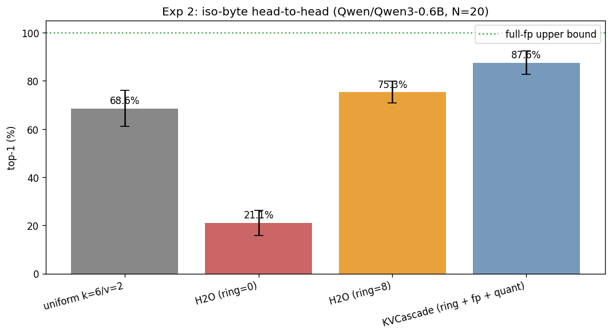

# KVCascade evaluation: `Qwen/Qwen3-0.6B`

- **Generated**: 2026-05-18 18:39:21
- **Total runtime**: 17.3 minutes
- **Samples**: 20 non-overlapping wikitext-103 chunks
- **Context length**: 4096 (prefill 4032, decode 64)
- **Dtype**: `bfloat16`, **device**: `cuda`, **seed**: 42
- **Quant tier**: `k_bits=6`, `v_bits=2`, single tier

## Model

| Property | Value |
|---|---|
| Name | `Qwen/Qwen3-0.6B` |
| Layers | 28 |
| Query heads | 16 |
| KV heads | 8 |
| Head dim | 128 |
| fp16 baseline cache | 458,752 KiB |

## Experiment 2: Iso-byte head-to-head

At the same byte budget (= uniform's), compare four cache strategies.

| Config | Bytes (KiB) | Compression vs fp16 | Top-1 | Cos sim | Prefill (tok/s) | Decode (tok/s) |
|---|---|---|---|---|---|---|
| full-fp (ref) | 458,752 | 1.00× | 100.0% ± 0.0% | 1.0000 ± 0.0000 | — | — |
| uniform k=6/v=2 | 120,064 | 3.82× | 68.6% ± 7.6% | 0.9245 ± 0.0221 | 2567.0 | 6.9 |
| H2O (ring=0) | 120,064 | 3.82× | 21.1% ± 5.2% | 0.5606 ± 0.0615 | 1819.2 | 10.3 |
| H2O (ring=8) | 120,064 | 3.82× | 75.3% ± 4.5% | 0.9681 ± 0.0130 | 1812.1 | 8.6 |
| KVCascade (ring + fp + quant) | 120,056 | 3.82× | 87.6% ± 5.0% | 0.9864 ± 0.0077 | 915.9 | 4.3 |

**Δ at iso-byte**: KVCascade vs uniform = +19.0 pp.
  H2O (ring=0) vs uniform = -47.5 pp.
  H2O (ring=8) vs uniform = +6.7 pp.
  Recency-ring lift on H2O = +54.2 pp (adding ring=8 on top of plain H2O).
  Quantization lift on H2O+ring = +12.3 pp (KVCascade adds the quant tier on top of H2O+ring).

---

*Raw per-sample results in `raw.json`. Reproduce with: `eval.py --model Qwen/Qwen3-0.6B --samples 20 --ctx-len 4096 --decode-len 64 --skip-exp1 --skip-viz --out /workspace/kvcascade/experiments/validation/runs/qwen3_4k_prod --quant-mode prod`*