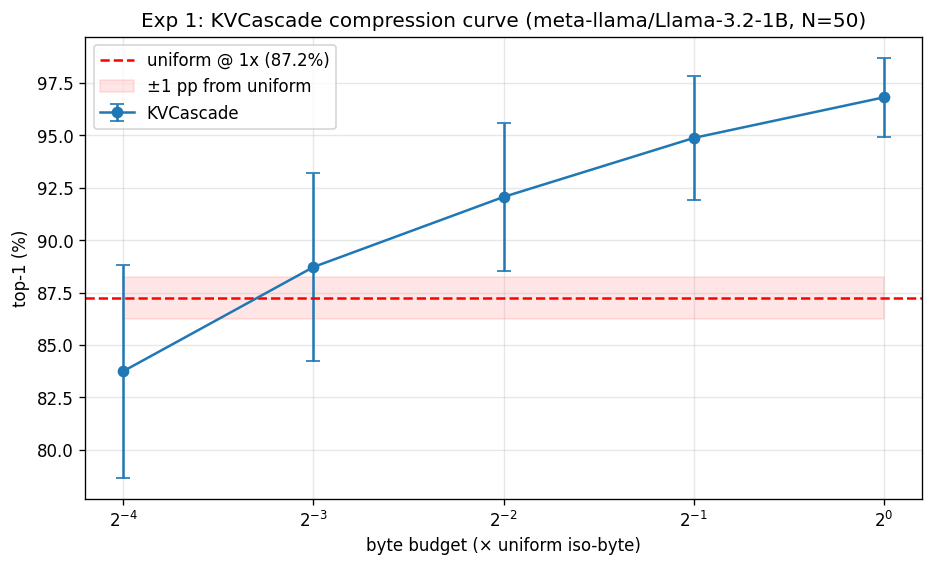
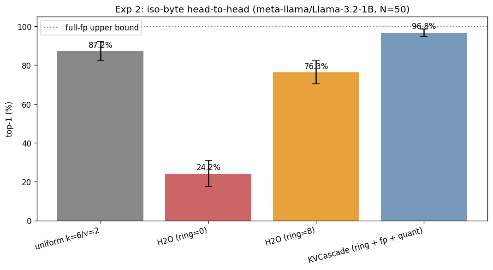

# KVCascade evaluation: `meta-llama/Llama-3.2-1B`

- **Generated**: 2026-04-29 19:08:10
- **Total runtime**: 24.7 minutes
- **Samples**: 50 non-overlapping wikitext-103 chunks
- **Context length**: 4096 (prefill 4032, decode 64)
- **Dtype**: `bfloat16`, **device**: `cuda`, **seed**: 42
- **Quant tier**: `k_bits=6`, `v_bits=2`, single tier

## Model

| Property | Value |
|---|---|
| Name | `meta-llama/Llama-3.2-1B` |
| Layers | 16 |
| Query heads | 32 |
| KV heads | 8 |
| Head dim | 64 |
| fp16 baseline cache | 131,072 KiB |

## Attention pattern analysis

Computed on the first sample's first 1024 tokens.

| Statistic | Value |
|---|---|
| Mean entropy | 2.55 nats (36.9% of uniform-max 6.93) |
| Median entropy | 2.36 nats |
| Range | [0.19, 6.29] |
| Peakiest head | layer 10, head 2 |
| Most diffuse head | layer 0, head 22 |

## Experiment 1: Compression sweep

How few bytes does KVCascade need to match uniform TurboQuant's quality?

| Config | Bytes (KiB) | Compression vs fp16 | Top-1 | Cos sim | Prefill (tok/s) | Decode (tok/s) |
|---|---|---|---|---|---|---|
| uniform `k=6/v=2` | 35,840 | 3.66× | 87.2% ± 5.0% | 0.9840 ± 0.0085 | 21457.2 | 27.1 |
| KVCascade @ 1× (fp=256, qt=3130) | 35,836 | 3.66× | 96.8% ± 1.9% | 0.9987 ± 0.0014 | 5781.8 | 15.8 |
| KVCascade @ 0.5× (fp=128, qt=1550) | 17,914 | 7.32× | 94.9% ± 3.0% | 0.9955 ± 0.0040 | 7723.5 | 16.2 |
| KVCascade @ 0.25× (fp=64, qt=760) | 8,954 | 14.64× | 92.1% ± 3.5% | 0.9893 ± 0.0104 | 10336.7 | 16.5 |
| KVCascade @ 0.125× (fp=32, qt=365) | 4,474 | 29.30× | 88.7% ± 4.5% | 0.9819 ± 0.0179 | 9805.7 | 16.4 |
| KVCascade @ 0.0625× (fp=16, qt=168) | 2,238 | 58.57× | 83.8% ± 5.1% | 0.9717 ± 0.0212 | 11917.1 | 16.4 |

**Headline**: KVCascade matches uniform within 1.0 pp at 0.1250× bytes (= 8.0× compression vs uniform).

## Experiment 2: Iso-byte head-to-head

At the same byte budget (= uniform's), compare four cache strategies.

| Config | Bytes (KiB) | Compression vs fp16 | Top-1 | Cos sim | Prefill (tok/s) | Decode (tok/s) |
|---|---|---|---|---|---|---|
| full-fp (ref) | 131,072 | 1.00× | 100.0% ± 0.0% | 1.0000 ± 0.0000 | — | — |
| uniform k=6/v=2 | 35,840 | 3.66× | 87.2% ± 5.0% | 0.9840 ± 0.0085 | 21457.2 | 27.1 |
| H2O (ring=0) | 35,840 | 3.66× | 24.2% ± 6.8% | 0.7451 ± 0.1071 | 11784.9 | 44.0 |
| H2O (ring=8) | 35,840 | 3.66× | 76.3% ± 6.0% | 0.9677 ± 0.0248 | 11553.8 | 34.2 |
| KVCascade (ring + fp + quant) | 35,836 | 3.66× | 96.8% ± 1.9% | 0.9987 ± 0.0014 | 5781.8 | 15.8 |

**Δ at iso-byte**: KVCascade vs uniform = +9.6 pp.
  H2O (ring=0) vs uniform = -63.1 pp.
  H2O (ring=8) vs uniform = -11.0 pp.
  Recency-ring lift on H2O = +52.1 pp (adding ring=8 on top of plain H2O).
  Quantization lift on H2O+ring = +20.5 pp (KVCascade adds the quant tier on top of H2O+ring).

---

*Raw per-sample results in `raw.json`. Reproduce with: `eval.py --model meta-llama/Llama-3.2-1B --ctx-len 4096 --decode-len 64 --samples 50 --out /outputs/llama_1B_4k`*