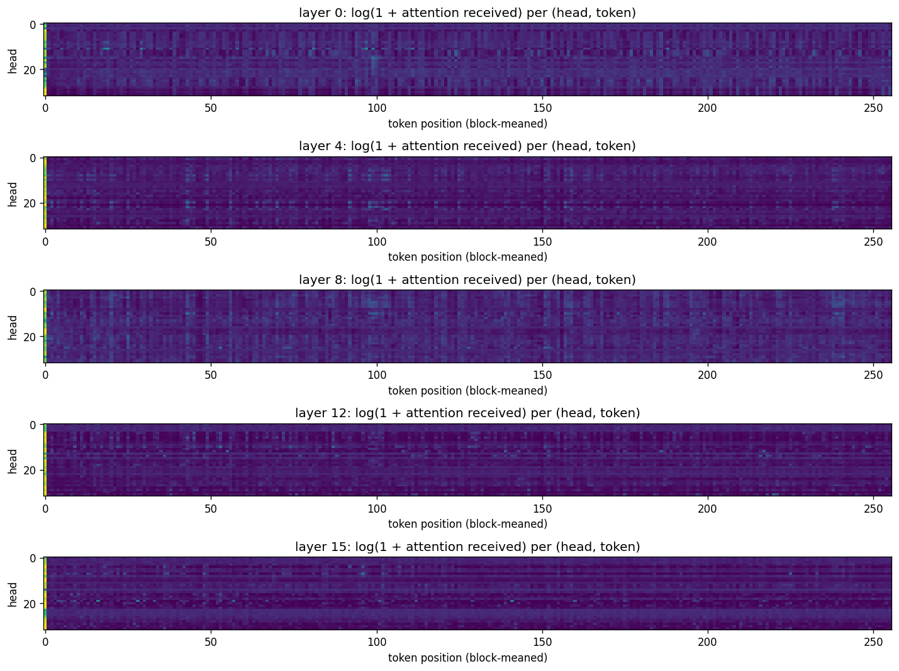
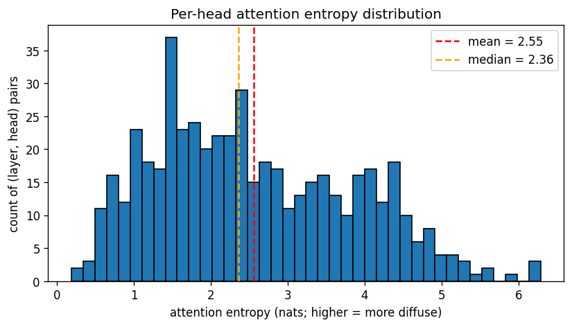
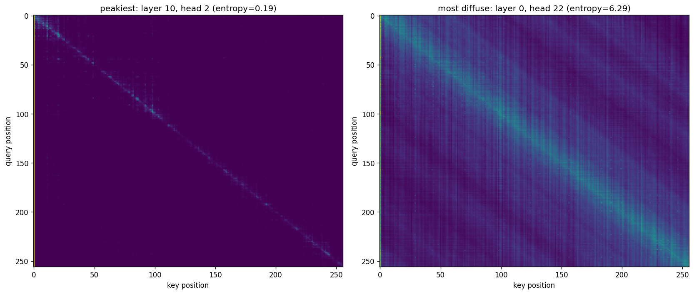
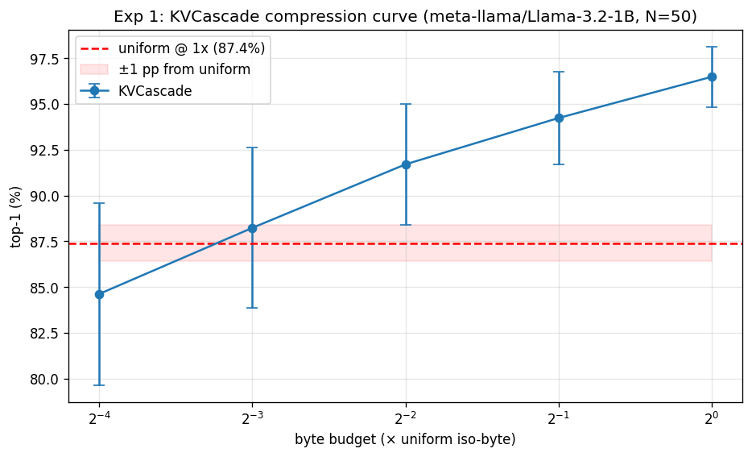
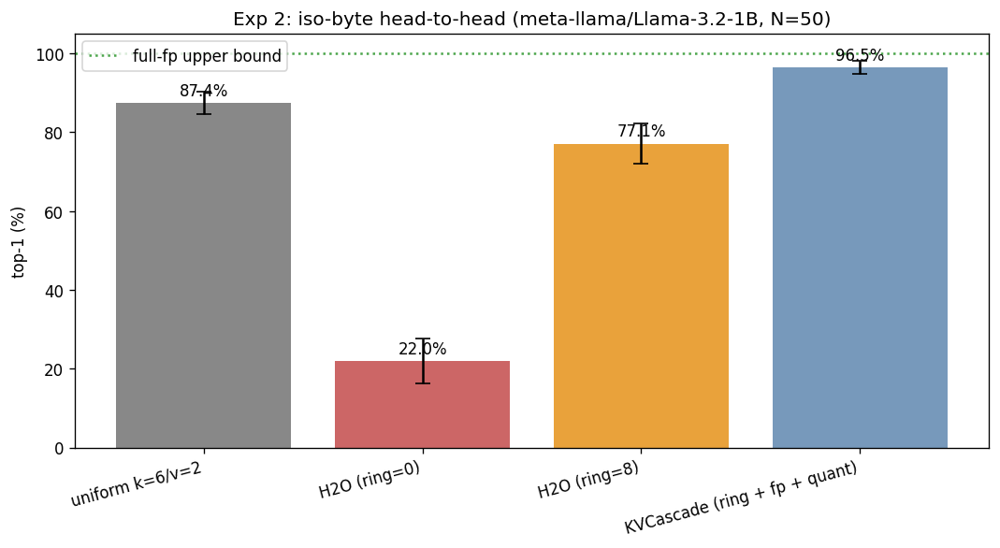

# KVCascade evaluation: `meta-llama/Llama-3.2-1B`

- **Generated**: 2026-04-29 19:28:52
- **Total runtime**: 45.3 minutes
- **Samples**: 50 non-overlapping wikitext-103 chunks
- **Context length**: 8192 (prefill 8064, decode 128)
- **Dtype**: `bfloat16`, **device**: `cuda`, **seed**: 42
- **Quant tier**: `k_bits=6`, `v_bits=2`, single tier

## Model

| Property | Value |
|---|---|
| Name | `meta-llama/Llama-3.2-1B` |
| Layers | 16 |
| Query heads | 32 |
| KV heads | 8 |
| Head dim | 64 |
| fp16 baseline cache | 262,144 KiB |

## Attention pattern analysis

Computed on the first sample's first 1024 tokens.

| Statistic | Value |
|---|---|
| Mean entropy | 2.55 nats (36.9% of uniform-max 6.93) |
| Median entropy | 2.36 nats |
| Range | [0.19, 6.29] |
| Peakiest head | layer 10, head 2 |
| Most diffuse head | layer 0, head 22 |

## Experiment 1: Compression sweep

How few bytes does KVCascade need to match uniform TurboQuant's quality?

| Config | Bytes (KiB) | Compression vs fp16 | Top-1 | Cos sim | Prefill (tok/s) | Decode (tok/s) |
|---|---|---|---|---|---|---|
| uniform `k=6/v=2` | 71,680 | 3.66× | 87.4% ± 2.9% | 0.9830 ± 0.0059 | 12786.5 | 35.2 |
| KVCascade @ 1× (fp=512, qt=6290) | 71,678 | 3.66× | 96.5% ± 1.7% | 0.9982 ± 0.0016 | 3256.8 | 19.4 |
| KVCascade @ 0.5× (fp=256, qt=3130) | 35,836 | 7.32× | 94.2% ± 2.5% | 0.9924 ± 0.0105 | 4498.2 | 19.5 |
| KVCascade @ 0.25× (fp=128, qt=1550) | 17,914 | 14.63× | 91.7% ± 3.3% | 0.9858 ± 0.0170 | 5538.1 | 19.8 |
| KVCascade @ 0.125× (fp=64, qt=760) | 8,954 | 29.28× | 88.2% ± 4.4% | 0.9778 ± 0.0207 | 6821.8 | 19.6 |
| KVCascade @ 0.0625× (fp=32, qt=365) | 4,474 | 58.60× | 84.6% ± 5.0% | 0.9685 ± 0.0236 | 6517.8 | 19.4 |

**Headline**: KVCascade matches uniform within 1.0 pp at 0.1250× bytes (= 8.0× compression vs uniform).

## Experiment 2: Iso-byte head-to-head

At the same byte budget (= uniform's), compare four cache strategies.

| Config | Bytes (KiB) | Compression vs fp16 | Top-1 | Cos sim | Prefill (tok/s) | Decode (tok/s) |
|---|---|---|---|---|---|---|
| full-fp (ref) | 262,144 | 1.00× | 100.0% ± 0.0% | 1.0000 ± 0.0000 | — | — |
| uniform k=6/v=2 | 71,680 | 3.66× | 87.4% ± 2.9% | 0.9830 ± 0.0059 | 12786.5 | 35.2 |
| H2O (ring=0) | 71,680 | 3.66× | 22.0% ± 5.6% | 0.7449 ± 0.0801 | 7019.9 | 55.5 |
| H2O (ring=8) | 71,680 | 3.66× | 77.1% ± 5.2% | 0.9631 ± 0.0166 | 6967.1 | 40.6 |
| KVCascade (ring + fp + quant) | 71,678 | 3.66× | 96.5% ± 1.7% | 0.9982 ± 0.0016 | 3256.8 | 19.4 |

**Δ at iso-byte**: KVCascade vs uniform = +9.1 pp.
  H2O (ring=0) vs uniform = -65.5 pp.
  H2O (ring=8) vs uniform = -10.3 pp.
  Recency-ring lift on H2O = +55.1 pp (adding ring=8 on top of plain H2O).
  Quantization lift on H2O+ring = +19.4 pp (KVCascade adds the quant tier on top of H2O+ring).

---

*Raw per-sample results in `raw.json`. Reproduce with: `eval.py --model meta-llama/Llama-3.2-1B --ctx-len 8192 --decode-len 128 --samples 50 --out /outputs/llama_1B_8k`*