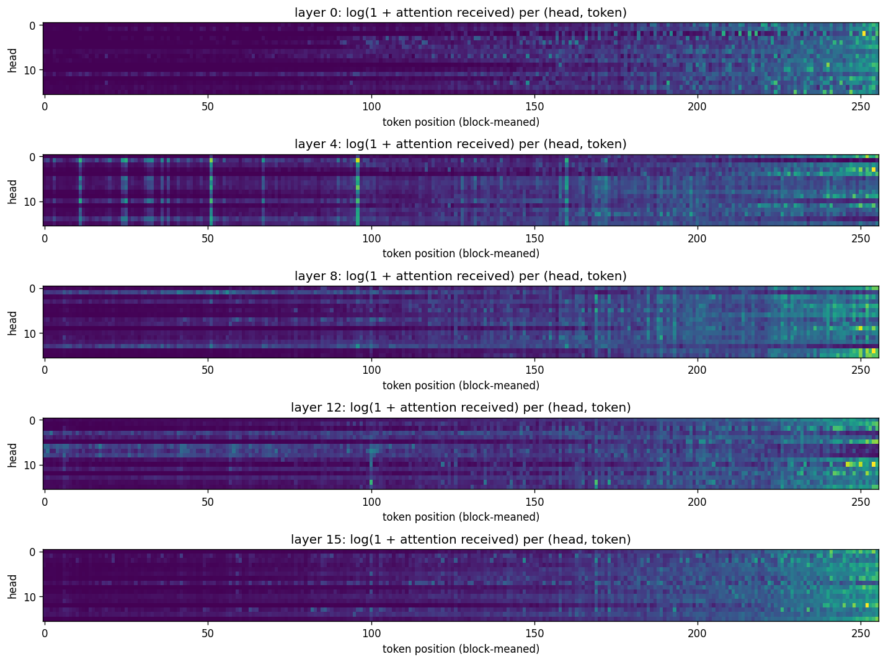
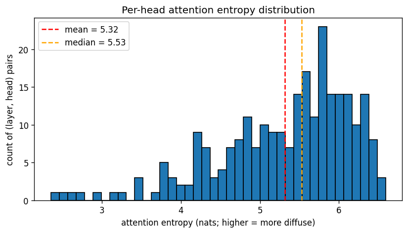
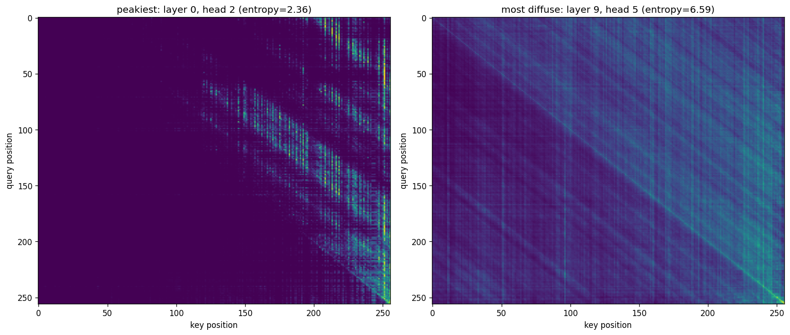
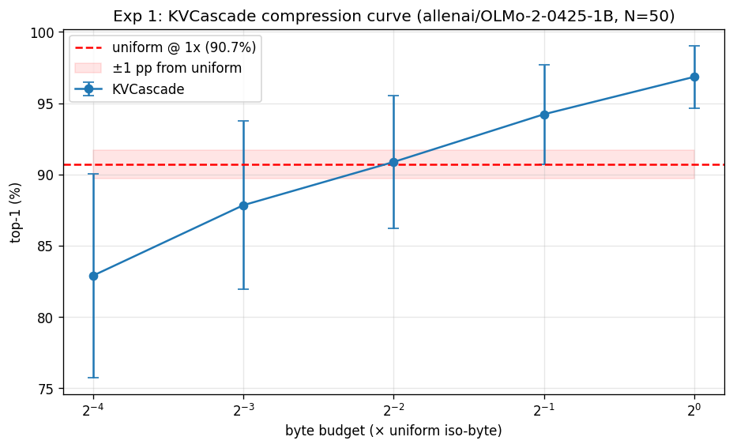
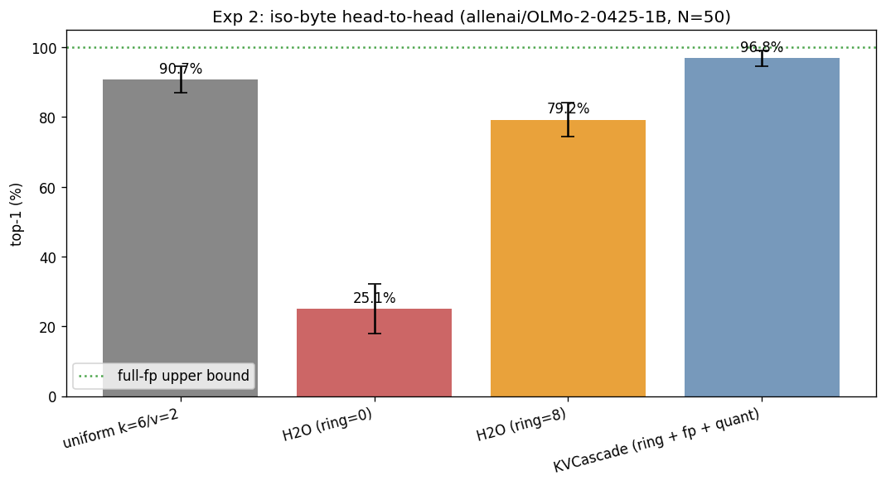

# KVCascade evaluation: `allenai/OLMo-2-0425-1B`

- **Generated**: 2026-04-29 19:05:54
- **Total runtime**: 22.4 minutes
- **Samples**: 50 non-overlapping wikitext-103 chunks
- **Context length**: 4096 (prefill 4032, decode 64)
- **Dtype**: `bfloat16`, **device**: `cuda`, **seed**: 42
- **Quant tier**: `k_bits=6`, `v_bits=2`, single tier

## Model

| Property | Value |
|---|---|
| Name | `allenai/OLMo-2-0425-1B` |
| Layers | 16 |
| Query heads | 16 |
| KV heads | 16 |
| Head dim | 128 |
| fp16 baseline cache | 524,288 KiB |

## Attention pattern analysis

Computed on the first sample's first 1024 tokens.

| Statistic | Value |
|---|---|
| Mean entropy | 5.32 nats (76.7% of uniform-max 6.93) |
| Median entropy | 5.53 nats |
| Range | [2.36, 6.59] |
| Peakiest head | layer 0, head 2 |
| Most diffuse head | layer 9, head 5 |

> Mean entropy > 70% of uniform — attention is **diffuse** on this workload. Eviction-only caches (H2O) should struggle; mixed-precision (KVCascade) should win.

## Experiment 1: Compression sweep

How few bytes does KVCascade need to match uniform TurboQuant's quality?

| Config | Bytes (KiB) | Compression vs fp16 | Top-1 | Cos sim | Prefill (tok/s) | Decode (tok/s) |
|---|---|---|---|---|---|---|
| uniform `k=6/v=2` | 137,216 | 3.82× | 90.7% ± 3.8% | 0.9997 ± 0.0001 | 28828.1 | 30.2 |
| KVCascade @ 1× (fp=256, qt=3087) | 137,206 | 3.82× | 96.8% ± 2.2% | 0.9999 ± 0.0002 | 9312.8 | 17.0 |
| KVCascade @ 0.5× (fp=128, qt=1528) | 68,596 | 7.64× | 94.2% ± 3.5% | 0.9997 ± 0.0005 | 14399.4 | 16.9 |
| KVCascade @ 0.25× (fp=64, qt=748) | 34,274 | 15.30× | 90.9% ± 4.7% | 0.9994 ± 0.0007 | 16019.3 | 17.0 |
| KVCascade @ 0.125× (fp=32, qt=359) | 17,146 | 30.58× | 87.8% ± 5.9% | 0.9989 ± 0.0010 | 15695.0 | 17.0 |
| KVCascade @ 0.0625× (fp=16, qt=164) | 8,566 | 61.21× | 82.9% ± 7.1% | 0.9981 ± 0.0014 | 18055.0 | 17.2 |

**Headline**: KVCascade matches uniform within 1.0 pp at 0.2500× bytes (= 4.0× compression vs uniform).

## Experiment 2: Iso-byte head-to-head

At the same byte budget (= uniform's), compare four cache strategies.

| Config | Bytes (KiB) | Compression vs fp16 | Top-1 | Cos sim | Prefill (tok/s) | Decode (tok/s) |
|---|---|---|---|---|---|---|
| full-fp (ref) | 524,288 | 1.00× | 100.0% ± 0.0% | 1.0000 ± 0.0000 | — | — |
| uniform k=6/v=2 | 137,216 | 3.82× | 90.7% ± 3.8% | 0.9997 ± 0.0001 | 28828.1 | 30.2 |
| H2O (ring=0) | 137,216 | 3.82× | 25.1% ± 7.2% | 0.9723 ± 0.0050 | 20102.6 | 45.2 |
| H2O (ring=8) | 137,216 | 3.82× | 79.2% ± 4.9% | 0.9984 ± 0.0006 | 20149.5 | 34.6 |
| KVCascade (ring + fp + quant) | 137,206 | 3.82× | 96.8% ± 2.2% | 0.9999 ± 0.0002 | 9312.8 | 17.0 |

**Δ at iso-byte**: KVCascade vs uniform = +6.1 pp.
  H2O (ring=0) vs uniform = -65.7 pp.
  H2O (ring=8) vs uniform = -11.5 pp.
  Recency-ring lift on H2O = +54.2 pp (adding ring=8 on top of plain H2O).
  Quantization lift on H2O+ring = +17.6 pp (KVCascade adds the quant tier on top of H2O+ring).

---

*Raw per-sample results in `raw.json`. Reproduce with: `eval.py --model allenai/OLMo-2-0425-1B --ctx-len 4096 --decode-len 64 --samples 50 --out /outputs/olmo2_1B_4k`*