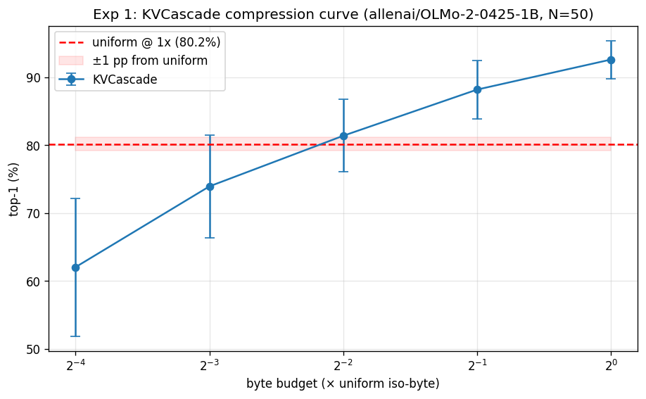
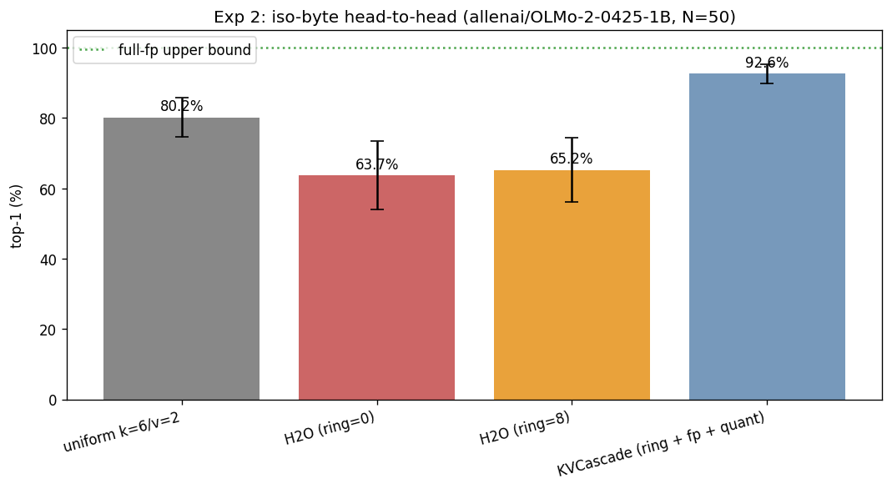

# KVCascade evaluation: `allenai/OLMo-2-0425-1B`

- **Generated**: 2026-04-29 19:25:23
- **Total runtime**: 41.7 minutes
- **Samples**: 50 non-overlapping wikitext-103 chunks
- **Context length**: 8192 (prefill 8064, decode 128)
- **Dtype**: `bfloat16`, **device**: `cuda`, **seed**: 42
- **Quant tier**: `k_bits=6`, `v_bits=2`, single tier

## Model

| Property | Value |
|---|---|
| Name | `allenai/OLMo-2-0425-1B` |
| Layers | 16 |
| Query heads | 16 |
| KV heads | 16 |
| Head dim | 128 |
| fp16 baseline cache | 1,048,576 KiB |

## Attention pattern analysis

Computed on the first sample's first 1024 tokens.

| Statistic | Value |
|---|---|
| Mean entropy | 5.32 nats (76.7% of uniform-max 6.93) |
| Median entropy | 5.53 nats |
| Range | [2.36, 6.59] |
| Peakiest head | layer 0, head 2 |
| Most diffuse head | layer 9, head 5 |

> Mean entropy > 70% of uniform — attention is **diffuse** on this workload. Eviction-only caches (H2O) should struggle; mixed-precision (KVCascade) should win.

## Experiment 1: Compression sweep

How few bytes does KVCascade need to match uniform TurboQuant's quality?

| Config | Bytes (KiB) | Compression vs fp16 | Top-1 | Cos sim | Prefill (tok/s) | Decode (tok/s) |
|---|---|---|---|---|---|---|
| uniform `k=6/v=2` | 274,432 | 3.82× | 80.2% ± 5.6% | 0.9998 ± 0.0001 | 20297.7 | 28.2 |
| KVCascade @ 1× (fp=512, qt=6205) | 274,428 | 3.82× | 92.6% ± 2.8% | 1.0000 ± 0.0000 | 5625.5 | 16.6 |
| KVCascade @ 0.5× (fp=256, qt=3087) | 137,206 | 7.64× | 88.2% ± 4.3% | 0.9999 ± 0.0000 | 7647.2 | 20.1 |
| KVCascade @ 0.25× (fp=128, qt=1528) | 68,596 | 15.29× | 81.4% ± 5.3% | 0.9998 ± 0.0000 | 10805.5 | 20.5 |
| KVCascade @ 0.125× (fp=64, qt=748) | 34,274 | 30.59× | 73.9% ± 7.5% | 0.9995 ± 0.0001 | 11688.0 | 20.8 |
| KVCascade @ 0.0625× (fp=32, qt=359) | 17,146 | 61.15× | 62.0% ± 10.2% | 0.9990 ± 0.0002 | 11190.2 | 21.6 |

**Headline**: KVCascade matches uniform within 1.0 pp at 0.2500× bytes (= 4.0× compression vs uniform).

## Experiment 2: Iso-byte head-to-head

At the same byte budget (= uniform's), compare four cache strategies.

| Config | Bytes (KiB) | Compression vs fp16 | Top-1 | Cos sim | Prefill (tok/s) | Decode (tok/s) |
|---|---|---|---|---|---|---|
| full-fp (ref) | 1,048,576 | 1.00× | 100.0% ± 0.0% | 1.0000 ± 0.0000 | — | — |
| uniform k=6/v=2 | 274,432 | 3.82× | 80.2% ± 5.6% | 0.9998 ± 0.0001 | 20297.7 | 28.2 |
| H2O (ring=0) | 274,432 | 3.82× | 63.7% ± 9.7% | 0.9989 ± 0.0004 | 12749.4 | 55.4 |
| H2O (ring=8) | 274,432 | 3.82× | 65.2% ± 9.2% | 0.9990 ± 0.0003 | 12338.1 | 43.8 |
| KVCascade (ring + fp + quant) | 274,428 | 3.82× | 92.6% ± 2.8% | 1.0000 ± 0.0000 | 5625.5 | 16.6 |

**Δ at iso-byte**: KVCascade vs uniform = +12.4 pp.
  H2O (ring=0) vs uniform = -16.5 pp.
  H2O (ring=8) vs uniform = -14.9 pp.
  Recency-ring lift on H2O = +1.5 pp (adding ring=8 on top of plain H2O).
  Quantization lift on H2O+ring = +27.4 pp (KVCascade adds the quant tier on top of H2O+ring).

---

*Raw per-sample results in `raw.json`. Reproduce with: `eval.py --model allenai/OLMo-2-0425-1B --ctx-len 8192 --decode-len 128 --samples 50 --out /outputs/olmo2_1B_8k`*