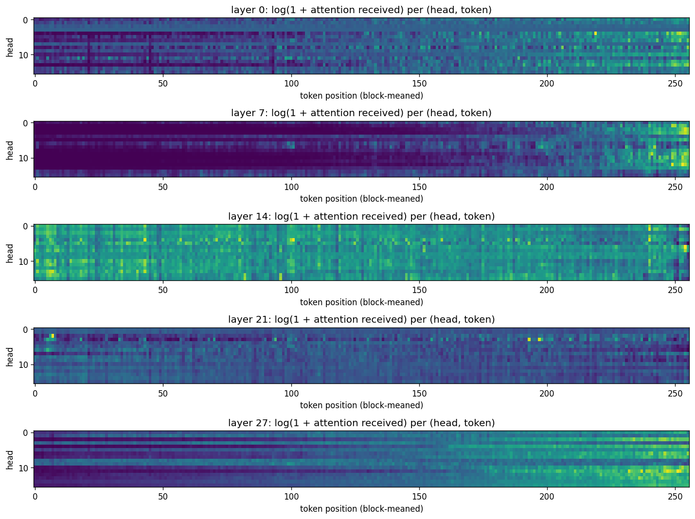
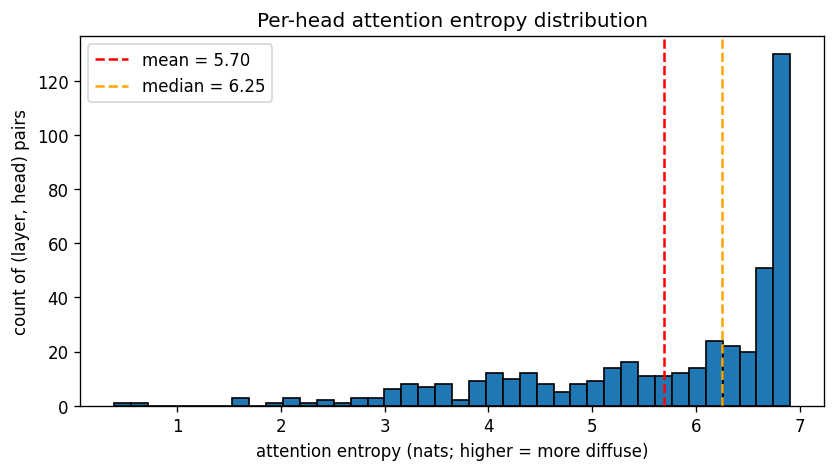
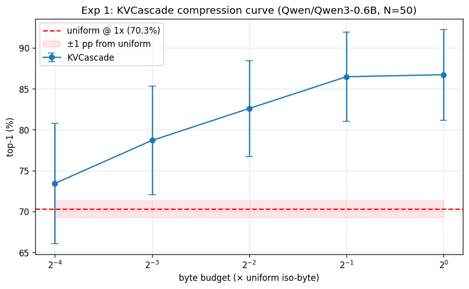
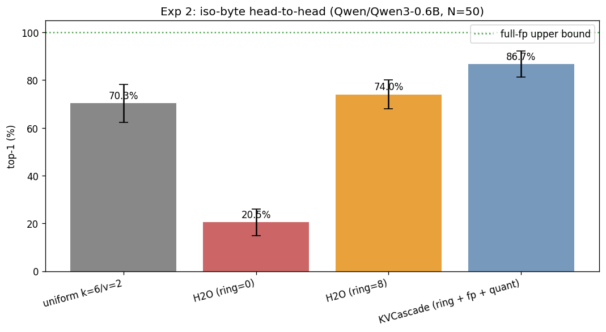

# KVCascade evaluation: `Qwen/Qwen3-0.6B`

- **Generated**: 2026-04-29 19:23:55
- **Total runtime**: 40.4 minutes
- **Samples**: 50 non-overlapping wikitext-103 chunks
- **Context length**: 4096 (prefill 4032, decode 64)
- **Dtype**: `bfloat16`, **device**: `cuda`, **seed**: 42
- **Quant tier**: `k_bits=6`, `v_bits=2`, single tier

## Model

| Property | Value |
|---|---|
| Name | `Qwen/Qwen3-0.6B` |
| Layers | 28 |
| Query heads | 16 |
| KV heads | 8 |
| Head dim | 128 |
| fp16 baseline cache | 458,752 KiB |

## Attention pattern analysis

Computed on the first sample's first 1024 tokens.

| Statistic | Value |
|---|---|
| Mean entropy | 5.70 nats (82.2% of uniform-max 6.93) |
| Median entropy | 6.25 nats |
| Range | [0.39, 6.91] |
| Peakiest head | layer 0, head 3 |
| Most diffuse head | layer 17, head 0 |

> Mean entropy > 70% of uniform — attention is **diffuse** on this workload. Eviction-only caches (H2O) should struggle; mixed-precision (KVCascade) should win.

## Experiment 1: Compression sweep

How few bytes does KVCascade need to match uniform TurboQuant's quality?

| Config | Bytes (KiB) | Compression vs fp16 | Top-1 | Cos sim | Prefill (tok/s) | Decode (tok/s) |
|---|---|---|---|---|---|---|
| uniform `k=6/v=2` | 120,064 | 3.82× | 70.3% ± 8.0% | 0.9256 ± 0.0209 | 21522.5 | 16.0 |
| KVCascade @ 1× (fp=256, qt=3087) | 120,056 | 3.82× | 86.7% ± 5.5% | 0.9857 ± 0.0087 | 5878.0 | 9.2 |
| KVCascade @ 0.5× (fp=128, qt=1528) | 60,022 | 7.64× | 86.5% ± 5.5% | 0.9830 ± 0.0148 | 8919.9 | 9.2 |
| KVCascade @ 0.25× (fp=64, qt=748) | 29,990 | 15.30× | 82.6% ± 5.9% | 0.9738 ± 0.0192 | 10235.1 | 9.3 |
| KVCascade @ 0.125× (fp=32, qt=359) | 15,003 | 30.58× | 78.7% ± 6.6% | 0.9610 ± 0.0255 | 9890.4 | 9.3 |
| KVCascade @ 0.0625× (fp=16, qt=164) | 7,495 | 61.21× | 73.4% ± 7.3% | 0.9459 ± 0.0302 | 11574.4 | 9.3 |

**Headline**: KVCascade matches uniform within 1.0 pp at 0.0625× bytes (= 16.0× compression vs uniform).

## Experiment 2: Iso-byte head-to-head

At the same byte budget (= uniform's), compare four cache strategies.

| Config | Bytes (KiB) | Compression vs fp16 | Top-1 | Cos sim | Prefill (tok/s) | Decode (tok/s) |
|---|---|---|---|---|---|---|
| full-fp (ref) | 458,752 | 1.00× | 100.0% ± 0.0% | 1.0000 ± 0.0000 | — | — |
| uniform k=6/v=2 | 120,064 | 3.82× | 70.3% ± 8.0% | 0.9256 ± 0.0209 | 21522.5 | 16.0 |
| H2O (ring=0) | 120,064 | 3.82× | 20.5% ± 5.6% | 0.5588 ± 0.0644 | 13000.7 | 23.2 |
| H2O (ring=8) | 120,064 | 3.82× | 74.0% ± 6.0% | 0.9681 ± 0.0116 | 12689.2 | 18.5 |
| KVCascade (ring + fp + quant) | 120,056 | 3.82× | 86.7% ± 5.5% | 0.9857 ± 0.0087 | 5878.0 | 9.2 |

**Δ at iso-byte**: KVCascade vs uniform = +16.4 pp.
  H2O (ring=0) vs uniform = -49.8 pp.
  H2O (ring=8) vs uniform = +3.8 pp.
  Recency-ring lift on H2O = +53.6 pp (adding ring=8 on top of plain H2O).
  Quantization lift on H2O+ring = +12.7 pp (KVCascade adds the quant tier on top of H2O+ring).

---

*Raw per-sample results in `raw.json`. Reproduce with: `eval.py --model Qwen/Qwen3-0.6B --ctx-len 4096 --decode-len 64 --samples 50 --out /outputs/qwen3_0.6B_4k`*