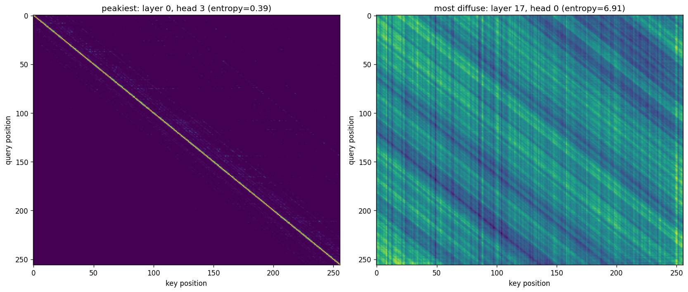
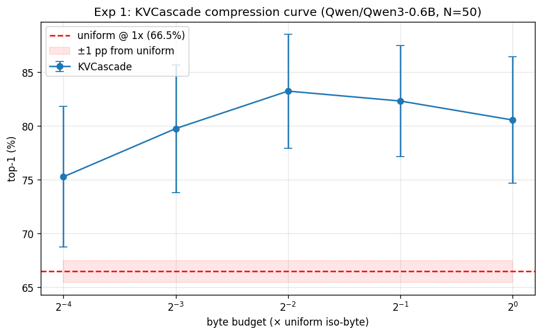
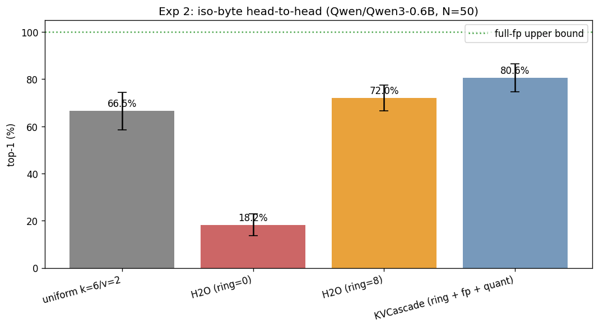

# KVCascade evaluation: `Qwen/Qwen3-0.6B`

- **Generated**: 2026-04-29 20:13:11
- **Total runtime**: 89.6 minutes
- **Samples**: 50 non-overlapping wikitext-103 chunks
- **Context length**: 8192 (prefill 8064, decode 128)
- **Dtype**: `bfloat16`, **device**: `cuda`, **seed**: 42
- **Quant tier**: `k_bits=6`, `v_bits=2`, single tier

## Model

| Property | Value |
|---|---|
| Name | `Qwen/Qwen3-0.6B` |
| Layers | 28 |
| Query heads | 16 |
| KV heads | 8 |
| Head dim | 128 |
| fp16 baseline cache | 917,504 KiB |

## Attention pattern analysis

Computed on the first sample's first 1024 tokens.

| Statistic | Value |
|---|---|
| Mean entropy | 5.70 nats (82.2% of uniform-max 6.93) |
| Median entropy | 6.25 nats |
| Range | [0.39, 6.91] |
| Peakiest head | layer 0, head 3 |
| Most diffuse head | layer 17, head 0 |

> Mean entropy > 70% of uniform — attention is **diffuse** on this workload. Eviction-only caches (H2O) should struggle; mixed-precision (KVCascade) should win.

## Experiment 1: Compression sweep

How few bytes does KVCascade need to match uniform TurboQuant's quality?

| Config | Bytes (KiB) | Compression vs fp16 | Top-1 | Cos sim | Prefill (tok/s) | Decode (tok/s) |
|---|---|---|---|---|---|---|
| uniform `k=6/v=2` | 240,128 | 3.82× | 66.5% ± 8.0% | 0.8904 ± 0.0287 | 13446.3 | 15.1 |
| KVCascade @ 1× (fp=512, qt=6205) | 240,124 | 3.82× | 80.6% ± 5.9% | 0.9701 ± 0.0106 | 3343.7 | 8.5 |
| KVCascade @ 0.5× (fp=256, qt=3087) | 120,056 | 7.64× | 82.3% ± 5.1% | 0.9742 ± 0.0128 | 4537.8 | 8.6 |
| KVCascade @ 0.25× (fp=128, qt=1528) | 60,022 | 15.29× | 83.2% ± 5.3% | 0.9724 ± 0.0156 | 6479.7 | 8.7 |
| KVCascade @ 0.125× (fp=64, qt=748) | 29,990 | 30.59× | 79.8% ± 5.9% | 0.9644 ± 0.0195 | 7096.4 | 8.7 |
| KVCascade @ 0.0625× (fp=32, qt=359) | 15,003 | 61.15× | 75.3% ± 6.6% | 0.9531 ± 0.0237 | 6732.4 | 8.8 |

**Headline**: KVCascade matches uniform within 1.0 pp at 0.0625× bytes (= 16.0× compression vs uniform).

## Experiment 2: Iso-byte head-to-head

At the same byte budget (= uniform's), compare four cache strategies.

| Config | Bytes (KiB) | Compression vs fp16 | Top-1 | Cos sim | Prefill (tok/s) | Decode (tok/s) |
|---|---|---|---|---|---|---|
| full-fp (ref) | 917,504 | 1.00× | 100.0% ± 0.0% | 1.0000 ± 0.0000 | — | — |
| uniform k=6/v=2 | 240,128 | 3.82× | 66.5% ± 8.0% | 0.8904 ± 0.0287 | 13446.3 | 15.1 |
| H2O (ring=0) | 240,128 | 3.82× | 18.2% ± 4.6% | 0.5231 ± 0.0542 | 7701.0 | 22.0 |
| H2O (ring=8) | 240,128 | 3.82× | 72.0% ± 5.5% | 0.9616 ± 0.0138 | 7646.3 | 17.7 |
| KVCascade (ring + fp + quant) | 240,124 | 3.82× | 80.6% ± 5.9% | 0.9701 ± 0.0106 | 3343.7 | 8.5 |

**Δ at iso-byte**: KVCascade vs uniform = +14.1 pp.
  H2O (ring=0) vs uniform = -48.3 pp.
  H2O (ring=8) vs uniform = +5.5 pp.
  Recency-ring lift on H2O = +53.8 pp (adding ring=8 on top of plain H2O).
  Quantization lift on H2O+ring = +8.6 pp (KVCascade adds the quant tier on top of H2O+ring).

---

*Raw per-sample results in `raw.json`. Reproduce with: `eval.py --model Qwen/Qwen3-0.6B --ctx-len 8192 --decode-len 128 --samples 50 --out /outputs/qwen3_0.6B_8k`*