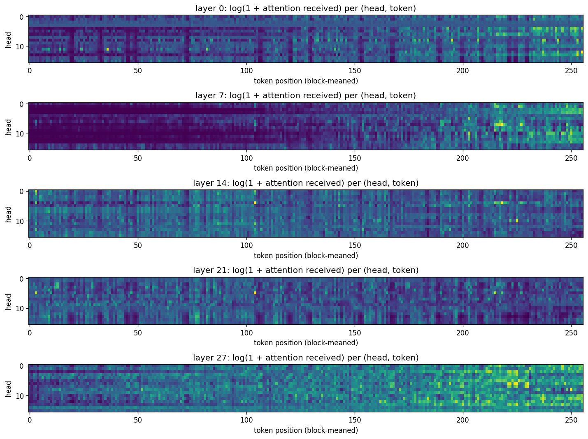
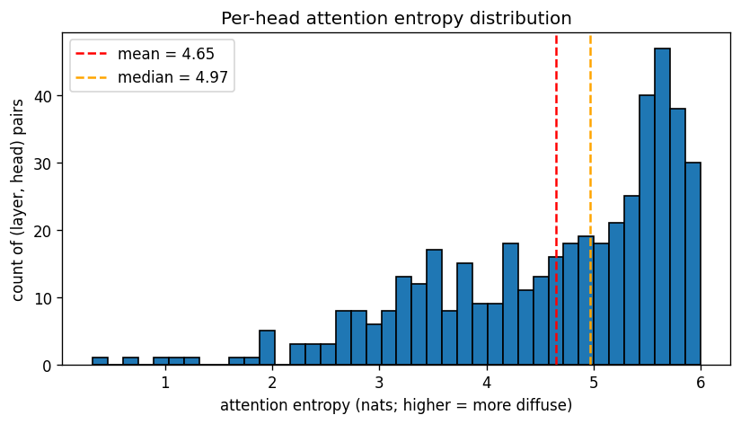
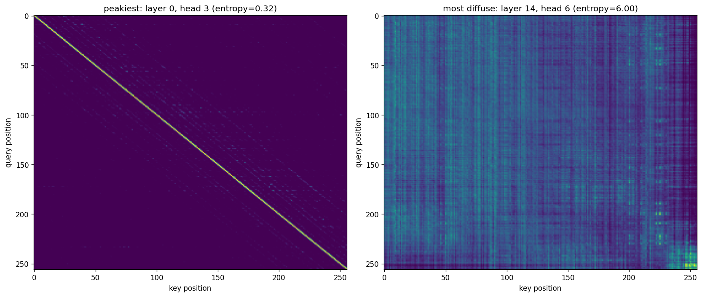
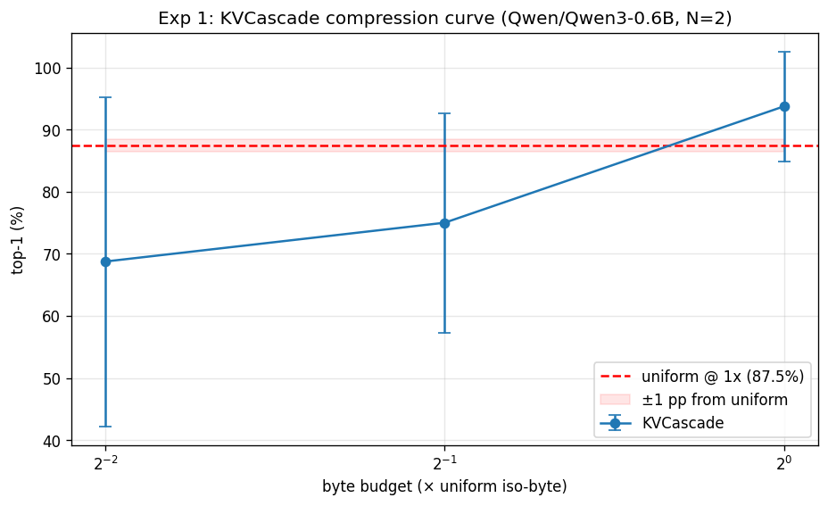
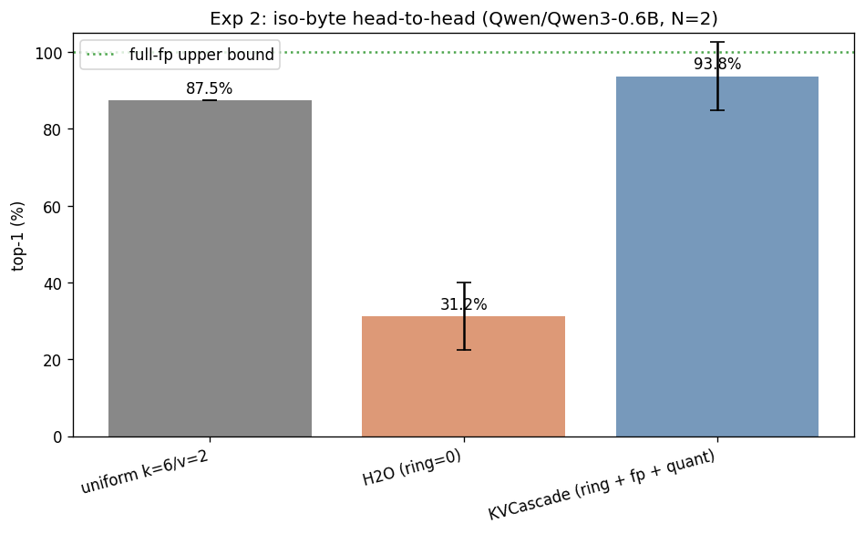
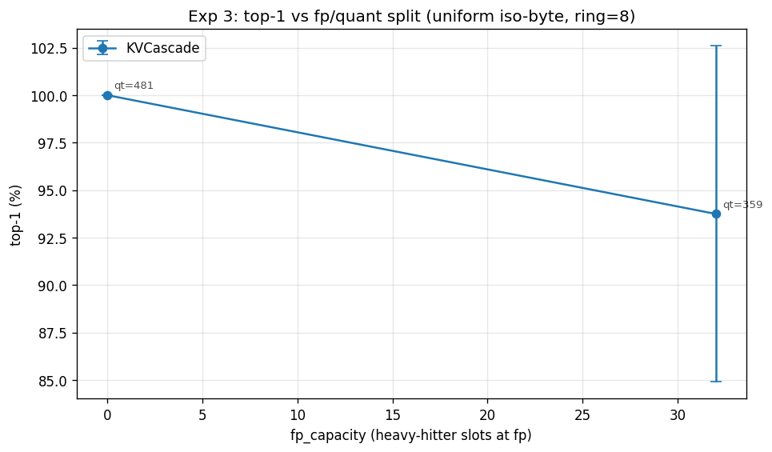

# KVCascade evaluation: `Qwen/Qwen3-0.6B`

- **Generated**: 2026-04-29 01:42:51
- **Total runtime**: 0.5 minutes
- **Samples**: 2 non-overlapping wikitext-103 chunks
- **Context length**: 512 (prefill 504, decode 8)
- **Dtype**: `bfloat16`, **device**: `cuda`, **seed**: 42
- **Quant tier**: `k_bits=6`, `v_bits=2`, single tier

## Model

| Property | Value |
|---|---|
| Name | `Qwen/Qwen3-0.6B` |
| Layers | 28 |
| Query heads | 16 |
| KV heads | 8 |
| Head dim | 128 |
| fp16 baseline cache | 57,344 KiB |

## Attention pattern analysis

Computed on the first sample's first 512 tokens.

| Statistic | Value |
|---|---|
| Mean entropy | 4.65 nats (74.5% of uniform-max 6.24) |
| Median entropy | 4.97 nats |
| Range | [0.32, 6.00] |
| Peakiest head | layer 0, head 3 |
| Most diffuse head | layer 14, head 6 |

> Mean entropy > 70% of uniform — attention is **diffuse** on this workload. Eviction-only caches (H2O) should struggle; mixed-precision (KVCascade) should win.

## Experiment 1: Compression sweep

How few bytes does KVCascade need to match uniform TurboQuant's quality?

| Config | Bytes (KiB) | Compression vs fp16 | Top-1 | Cos sim |
|---|---|---|---|---|
| uniform `k=6/v=2` | 15,008 | 3.82× | 87.5% ± 0.0% | 0.9529 ± 0.0018 |
| KVCascade @ 1× (fp=32, qt=359) | 15,003 | 3.82× | 93.8% ± 8.8% | 0.9916 ± 0.0070 |
| KVCascade @ 0.5× (fp=16, qt=164) | 7,495 | 7.65× | 75.0% ± 17.7% | 0.9531 ± 0.0515 |
| KVCascade @ 0.25× (fp=8, qt=66) | 3,727 | 15.39× | 68.8% ± 26.5% | 0.9307 ± 0.0547 |

**Headline**: KVCascade matches uniform within 1.0 pp at 1.0000× bytes (= 1.0× compression vs uniform).

## Experiment 2: Iso-byte head-to-head

At the same byte budget (= uniform's), compare four cache strategies.

| Config | Bytes (KiB) | Compression vs fp16 | Top-1 | Cos sim |
|---|---|---|---|---|
| full-fp (ref) | 57,344 | 1.00× | 100.0% ± 0.0% | 1.0000 ± 0.0000 |
| uniform k=6/v=2 | 15,008 | 3.82× | 87.5% ± 0.0% | 0.9529 ± 0.0018 |
| H2O (ring=0) | 15,008 | 3.82× | 31.2% ± 8.8% | 0.5676 ± 0.1696 |
| KVCascade (ring + fp + quant) | 15,003 | 3.82× | 93.8% ± 8.8% | 0.9916 ± 0.0070 |

**Δ at iso-byte**: KVCascade vs uniform = +6.2 pp.
  H2O vs uniform = -56.2 pp.

## Experiment 3: Split sweep at fixed budget

Total bytes fixed at uniform's iso-byte budget. `ring_size=8` throughout; `fp_capacity` is swept and `quant_capacity` is derived from the budget.

| ring | fp_cap | qt_cap | Bytes (KiB) | Top-1 | Cos sim |
|---|---|---|---|---|---|
| 8 | 0 | 481 | 14,995 | 100.0% ± 0.0% | 0.9806 ± 0.0116 |
| 8 | 32 | 359 | 15,003 | 93.8% ± 8.8% | 0.9916 ± 0.0070 |

**Best split**: `fp=0, qt=481` → top-1 100.0% ± 0.0%.

---

*Raw per-sample results in `raw.json`. Reproduce with: `eval.py --samples 2 --ctx-len 512 --decode-len 8 --exp1-ratios 1.0,0.5,0.25 --exp3-fp-caps 0,32,128 --out outputs/smoketest`*